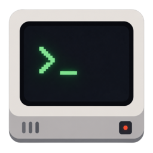

# Cathode — CRT Terminal Emulator



A GTK4/libadwaita terminal emulator with a retro CRT scanline shader.

## Features

- **CRT retro effect pipeline** — 12 configurable effects:
  - Scanlines, phosphor glow, inline bloom, aperture grille, edge softening, color bleed
  - Pixel rounding, depth shadows, burn-in, jitter, flickering, glowing line
  - Curvature + chromatic aberration + vignetting + film grain + warm white point
- **Multiple tabs** — AdwTabView + AdwTabBar with keyboard shortcuts
- **Search** — Ctrl+Shift+F with VTE regex, Enter/Shift+Enter navigation
- **Header bar menu** — copy, paste, search, new/close/rename tab, clear screen, reset terminal, open config, quit
- **Config auto-reload** — GFileMonitor watches `cathode.toml`, applies changes on save
- **TOML config** — themes, fonts, shell, CRT parameters all configurable with sensible defaults

## Build

### Dependencies

- gtk4 >= 4.12
- libadwaita-1 >= 1.4
- vte-2.91-gtk4 >= 0.74
- epoxy >= 1.5
- cairo >= 1.16
- glib-2.0 >= 2.76
- meson >= 1.0.0

### Compile & Run

```bash
meson setup build
meson compile -C build
./build/src/cathode
```

### Install

```bash
meson install -C build
```

Installs:
- Binary → `$prefix/bin/cathode`
- Desktop entry → `$prefix/share/applications/com.n0zoberi.Cathode.desktop`
- Icons → `$prefix/share/icons/hicolor/` (16×16 to 512×512)
- Sample config → `$prefix/share/cathode/`

## Config

See `cathode.sample.toml` for the full reference, or copy it to `~/.config/cathode/cathode.toml` to get started.

### CRT Parameters

| Key | Default | Description |
|---|---|---|
| `scanline_intensity` | `0.06` | Scanline darkness (0=off, 1=black) |
| `scanline_period` | `6` | Pixel rows per scanline group |
| `bloom_strength` | `0.05` | Global screen brightness boost |
| `bloom_sigma` | `4.5` | Bloom blur radius |
| `glow_strength` | `0.2` | Phosphor glow on bright text |
| `glow_threshold_low` | `0.15` | Min luma for glow effect |
| `glow_threshold_high` | `0.6` | Luma threshold for full glow |
| `mask_strength` | `0.012` | Aperture grille stripe visibility |
| `curvature` | `0.0` | Barrel distortion |
| `chromatic_aberration` | `0.0` | RGB separation at edges |
| `softening` | `0.12` | Edge softening |
| `color_bleed` | `0.08` | Horizontal color smear |
| `rounding` | `0.15` | Pixel roundness |
| `shadow_strength` | `0.10` | Bezel + inner depth shadow |
| `burn_in` | `0.0` | Phosphor persistence |
| `jitter` | `0.0` | Electron beam jitter |
| `flickering` | `0.0` | Brightness ripple |
| `glowing_line` | `0.0` | Scrolling bright scanline |

Set any value to `0` to disable that effect. All CRT params at `0` → GLArea hidden, zero overhead.

### Theme Format

Imported theme files use the `[colors]` table. Primary colors can be placed directly under `[colors]` or nested in `[colors.primary]`:

```toml
[colors]
foreground = "#ffffff"
background = "#000000"

[colors.primary]
foreground = "#ffffff"
background = "#000000"
cursor = "#ffffff"
selection_background = "#aaaaaa"

[colors.normal]
color0 = "#000000"
color1 = "#aa0000"
# color2–color7

[colors.bright]
color8 = "#555555"
color9 = "#ff5555"
# color10–color15
```

## Keyboard Shortcuts

| Shortcut | Action |
|---|---|
| Ctrl+Shift+T | New tab |
| Ctrl+Shift+W | Close tab |
| Ctrl+Shift+F | Toggle search |
| Ctrl+Shift+C / Ctrl+Alt+C | Copy |
| Ctrl+Shift+V / Ctrl+Alt+V | Paste |
| Ctrl+= / Ctrl++ | Increase font |
| Ctrl+- | Decrease font |
| Ctrl+0 | Reset font size |
| Ctrl+Tab / Ctrl+PgDown | Next tab |
| Ctrl+Shift+Tab / Ctrl+PgUp | Prev tab |

## License

MIT. TOML parser: [tomlc99](https://github.com/cktan/tomlc99) (MIT).

## Acknowledgments

Several CRT effect concepts were inspired by:
- [Retro.hlsl](https://github.com/microsoft/terminal) from Windows Terminal — scanlines, bloom, curvature, chromatic aberration, aperture grille, vignetting.
- [cool-retro-term](https://github.com/Swordfish90/cool-retro-term) (GPL-3.0) — burn-in, jitter, flickering, glowing line.

All implementation is original to this project.
