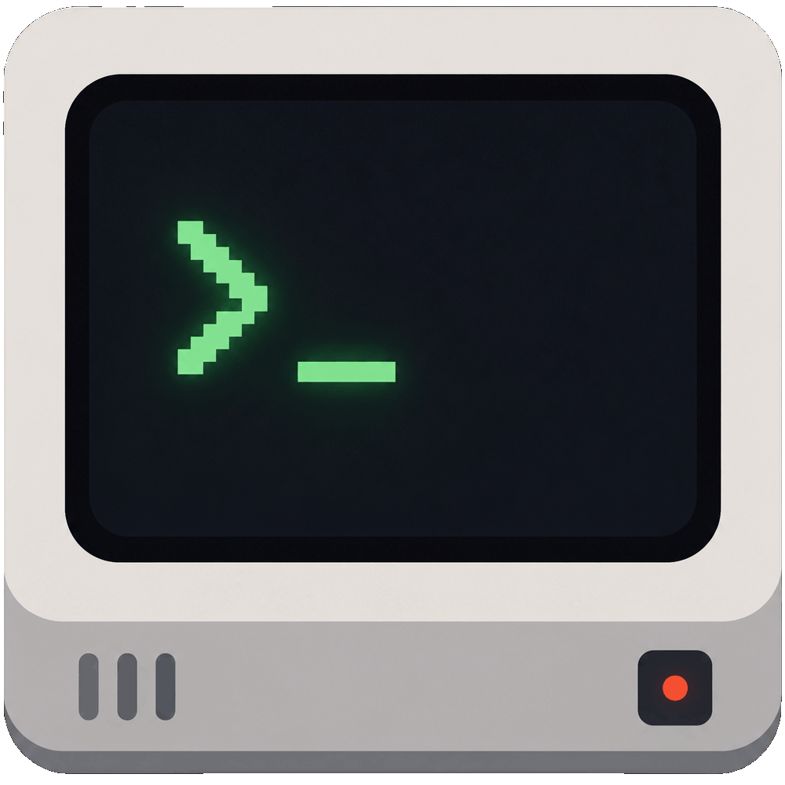

# Cathode — CRT Terminal Emulator

[](https://opensource.org/licenses/MIT)
[](https://en.wikipedia.org/wiki/C_(programming_language))

<p align="center">
  
</p>

A GTK4/libadwaita terminal emulator with a retro CRT scanline shader. GPU‑accelerated post‑processing brings scanlines, phosphor glow, aperture grille, and curvature effects to your terminal — with zero overhead when all effects are off.

## Table of Contents

- [Features](#features)
- [Installation](#installation)
  - [Dependencies](#dependencies)
  - [Build & Install](#build--install)
  - [Arch Linux](#arch-linux)
- [Configuration](#configuration)
  - [CRT Parameters](#crt-parameters)
  - [Theme Format](#theme-format)
- [Keyboard Shortcuts](#keyboard-shortcuts)
- [License](#license)
- [Acknowledgments](#acknowledgments)

## Features

**CRT Effect Pipeline** — 18 configurable effects rendered in a single GPU pass:

- **Beam & Geometry** — Curvature (barrel distortion), beam jitter, chromatic aberration
- **Phosphor Light** — Halation, isotropic bloom, warm P22 phosphor glow
- **Beam Spot** — Sub-pixel softening, pixel rounding (gaussian spot profile)
- **Physical Mask** — Scanlines (gaussian beam or square wave), aperture grille / shadow mask
- **Glass & Enclosure** — Bezel depth shadows, inner edge falloff, corner vignette
- **Analog Imperfections** — Glowing retrace line, film grain, PSU flickering, burn-in
- **Color** — Gamma‑corrected linear pipeline, warm white point (~6500 K)

All effects are configurable individually. Set any parameter to `0` to disable it — the GL overlay hides completely with zero GPU overhead.

**Terminal**

- Multiple tabs via AdwTabView + AdwTabBar
- Ctrl+Shift+F search bar with VTE regex, Enter/Shift+Enter navigation
- Header bar menu: copy, paste, search, tabs, clear screen, reset terminal, open config, quit
- Customizable key bindings via TOML config

**Configuration**

- TOML‑based configuration with sensible defaults
- GFileMonitor‑based auto‑reload — apply changes without restarting
- Theme import system with `~/` path expansion
- Configurable shell, font, scrollback, cursor blink mode

## Installation

### Dependencies

| Dependency | Version |
|---|---|
| gtk4 | >= 4.12 |
| libadwaita-1 | >= 1.4 |
| vte-2.91-gtk4 | >= 0.74 |
| epoxy | >= 1.5 |
| cairo | >= 1.16 |
| glib-2.0 | >= 2.76 |
| meson | >= 1.0.0 |

### Build & Install

```bash
meson setup build
meson compile -C build
meson install -C build
```

Installs the binary, desktop entry, icons, and sample config into standard prefix paths.

### Arch Linux

A PKGBUILD is provided in `dist/arch/`. Build and install with:

```bash
cd dist/arch
makepkg -si
```

## Configuration

Copy the sample config and edit it to your liking:

```bash
mkdir -p ~/.config/cathode
cp cathode.sample.toml ~/.config/cathode/cathode.toml
```

See [`cathode.sample.toml`](cathode.sample.toml) for the complete reference with inline documentation.

### CRT Parameters

| Key | Default | Description |
|---|---|---|
| `scanline_mode` | `0` | 0 = gaussian beam, 1 = square wave |
| `scanline_intensity` | `0.06` | Scanline darkness (0 = off, 1 = black) |
| `scanline_period` | `6` | Pixel rows per scanline group |
| `bloom_strength` | `0.30` | 2D gaussian bloom blend factor |
| `bloom_sigma` | `4.5` | Bloom blur radius (gaussian sigma) |
| `halation_strength` | `0.10` | Glass light diffusion intensity |
| `halation_sigma` | `8.0` | Halation blur radius (gaussian sigma) |
| `glow_strength` | `0.2` | Phosphor glow on bright text |
| `glow_threshold_low` | `0.0` | Min luma for glow effect |
| `glow_threshold_high` | `1.0` | Luma threshold for full glow |
| `mask_strength` | `0.012` | Aperture grille stripe visibility |
| `curvature` | `0.0` | Barrel distortion |
| `chromatic_aberration` | `0.0` | RGB separation at edges |
| `softening` | `0.12` | Sub-pixel edge softening |
| `rounding` | `0.15` | Pixel roundness (beam spot) |
| `shadow_strength` | `0.10` | Bezel + inner depth shadow |
| `burn_in` | `0.0` | Phosphor persistence ghosting |
| `jitter` | `0.0` | Electron beam jitter |
| `flickering` | `0.0` | Brightness ripple (PSU) |
| `glowing_line` | `0.0` | Scrolling retrace line |

### Theme Format

Import theme files via `[general].import`. Themes use the `[colors]` table:

```toml
[colors]
foreground = "#ffffff"
background = "#000000"

[colors.normal]
color0  = "#000000"
color1  = "#aa0000"
# ... color2 through color7

[colors.bright]
color8  = "#555555"
color9  = "#ff5555"
# ... color10 through color15
```

Primary colors can also be nested under `[colors.primary]` with optional `cursor` and `selection_background` fields.

## Keyboard Shortcuts

| Shortcut | Action |
|---|---|
| Ctrl+Shift+T | New tab |
| Ctrl+Shift+W | Close tab |
| Ctrl+Shift+F | Toggle search |
| Ctrl+Shift+C / Ctrl+Alt+C | Copy |
| Ctrl+Shift+V / Ctrl+Alt+V | Paste |
| Ctrl+= / Ctrl++ | Increase font |
| Ctrl+- | Decrease font |
| Ctrl+0 | Reset font size |
| Ctrl+Tab / Ctrl+PgDown | Next tab |
| Ctrl+Shift+Tab / Ctrl+PgUp | Previous tab |

Key bindings can be customized via the `[bindings]` table in `cathode.toml`.

## License

MIT. The bundled TOML parser, [tomlc99](https://github.com/cktan/tomlc99), is also MIT.

## Acknowledgments

CRT effect concepts inspired by:

- [Retro.hlsl](https://github.com/microsoft/terminal) from Windows Terminal — scanlines, bloom, curvature, chromatic aberration, aperture grille, vignetting
- [cool-retro-term](https://github.com/Swordfish90/cool-retro-term) (GPL-3.0) — burn-in, jitter, flickering, glowing line

All implementation is original to this project.